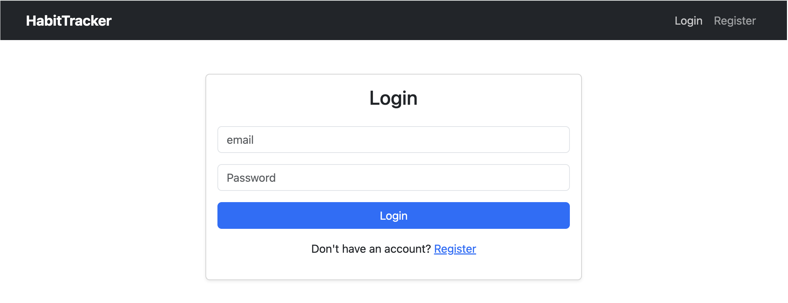
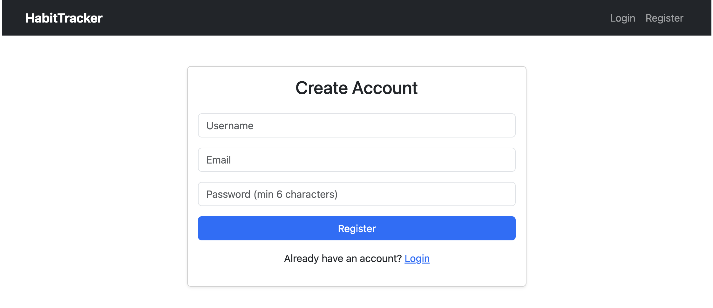
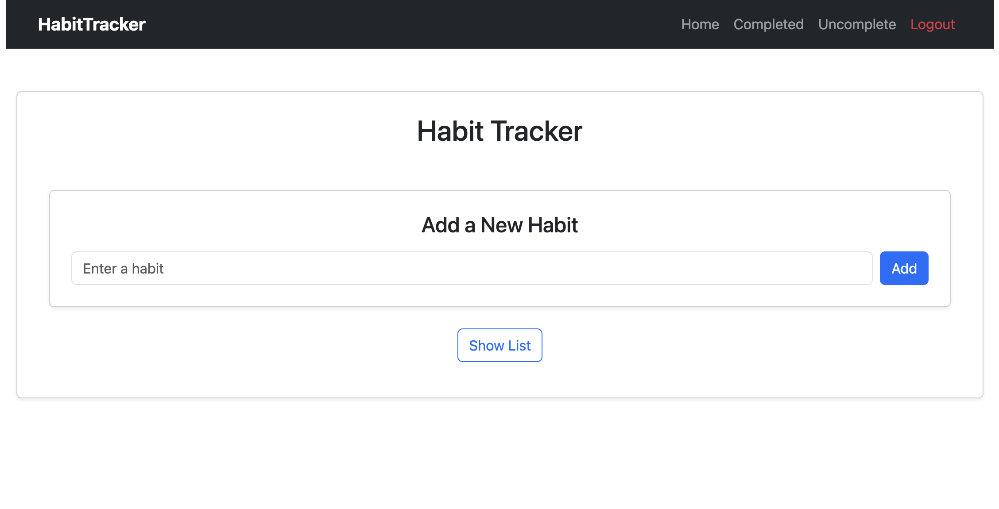
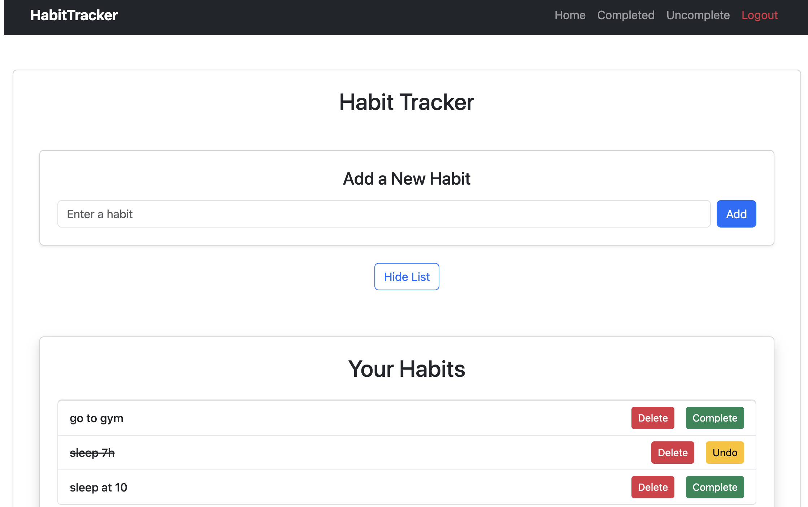
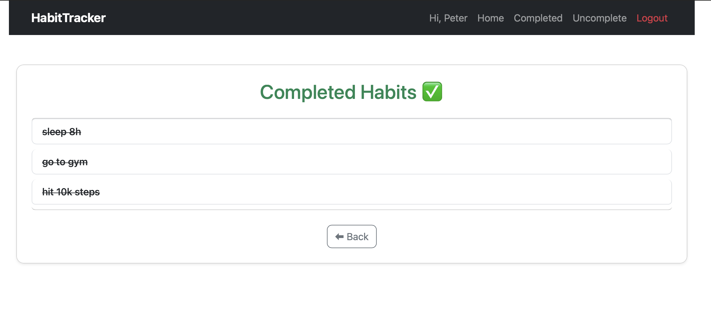
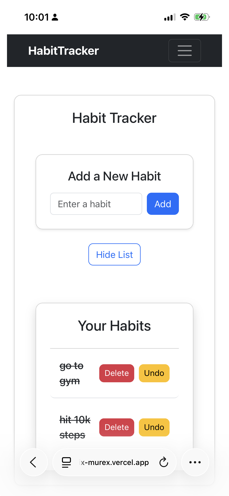

# Habit Tracker

A full-stack habit tracking application for creating an account, managing personal habits, and tracking completion progress through a secure client-server workflow.

## 🎥 2-Minute Walkthrough

https://www.loom.com/share/f69f4dce4b53414299a23805874cc25b

## 🌐 Live Demo

https://habit-tracker-six-murex.vercel.app

## 💻 Source Code

https://github.com/PhilBKouokam/HabitTracker

## 📸 Screenshots

<table>
  <tr>
    <td align="center" width="50%">
      <strong>Login</strong><br />
      
    </td>
    <td align="center" width="50%">
      <strong>Registration</strong><br />
      
    </td>
  </tr>
  <tr>
    <td align="center" width="50%">
      <strong>Create Habit</strong><br />
      
    </td>
    <td align="center" width="50%">
      <strong>Habit Dashboard</strong><br />
      
    </td>
  </tr>
  <tr>
    <td align="center" width="50%">
      <strong>Completed Habits</strong><br />
      
    </td>
    <td align="center" width="50%">
      <strong>Mobile Responsive View</strong><br />
      
    </td>
  </tr>
</table>

## Why I Built This

I built Habit Tracker to practice the engineering patterns behind production-style full-stack applications: authentication, protected user data, persistent CRUD operations, and clear communication between a frontend client and backend API.

The project focuses on the full request lifecycle. A user action starts in React, flows through shared frontend state, reaches an Express REST API, persists data in MongoDB through Mongoose, and returns a response that updates the UI.

This gave me practical experience building account-based features, protecting user-specific records, and deploying separate frontend and backend services.

## Features

- Register and log in with JWT-based authentication.
- Create habits tied to the authenticated user.
- View all habits, completed habits, and incomplete habits.
- Mark habits complete or undo completion.
- Delete habits from the user account.
- Protect habit pages from unauthenticated access.
- Persist user and habit data in MongoDB.
- Use responsive Bootstrap styling for a clean interface.

## Engineering Highlights

- JWT authentication for stateless user sessions.
- bcrypt password hashing before user records are stored.
- Protected React Router routes for authenticated pages.
- React Context for shared authentication state.
- REST API design for auth and habit operations.
- MongoDB and Mongoose for structured persistence.
- Authentication middleware that verifies tokens before habit routes run.
- Client-server architecture with separate frontend and backend deployments.
- User-scoped database queries to protect private habit data.
- React state management for immediate UI updates after API responses.

## 🏗 Architecture

Habit Tracker follows a simple client-server architecture where the frontend owns the user experience and the backend owns authentication, authorization, and persistence.

`React UI` → `React Context` → `REST API` → `Express Controllers` → `MongoDB with Mongoose` → `API Response` → `React UI Update`

## Key User Flows

`Register` → `Login` → `Create Habit` → `Complete / Undo` → `Delete Habit`

## Tech Stack

**Frontend:** React, React Router, React Context, JavaScript, Bootstrap, Vite

**Backend:** Node.js, Express, JavaScript

**Database:** MongoDB, Mongoose

**Authentication:** JWT, bcrypt

**Deployment:** Vercel frontend, Render backend

**Developer Tools:** npm, ESLint, Git, GitHub

## API Overview

| Method | Route | Description | JWT Required |
| --- | --- | --- | --- |
| POST | `/api/auth/register` | Create a user, hash the password, and return a JWT. | No |
| POST | `/api/auth/login` | Validate credentials and return a JWT. | No |
| GET | `/api/habits` | Fetch habits for the authenticated user. | Yes |
| POST | `/api/habits` | Create a habit for the authenticated user. | Yes |
| PATCH | `/api/habits/:id` | Update completion status and completion date. | Yes |
| DELETE | `/api/habits/:id` | Delete a habit owned by the authenticated user. | Yes |

## 🚀 Future Improvements

- Add full habit editing for updating habit names and details.
- Track habit streaks and completion history over time.
- Add a calendar view for weekly and monthly progress.
- Send email reminders for habits that are due.
- Add push notifications for recurring habits.
- Add automated frontend and backend tests.
- Strengthen request validation with a schema validation library.
- Move authentication to HTTP-only cookies for stronger token storage.
- Build an analytics dashboard for completion rates and consistency trends.

## Local Development

### Prerequisites

- Node.js
- npm
- MongoDB connection string

### Backend

```bash
cd backend
npm install
npm run dev
```

Create `backend/.env` using `backend/.env.example`:

```bash
PORT=4500
MONGO_URI=mongodb+srv://<username>:<password>@<cluster-url>/<database-name>
JWT_SECRET=replace-with-a-long-random-development-secret
FRONTEND_URL=http://localhost:5173
```

### Frontend

```bash
cd frontend
npm install
npm run dev
```

Create `frontend/.env` using `frontend/.env.example`:

```bash
VITE_API_BASE_URL=http://localhost:4500
```

Open the frontend development server in your browser, register an account, and start tracking habits.
